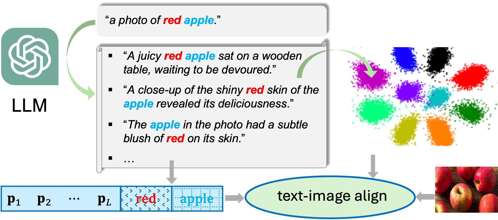

# Prompting Language-Informed Distribution (PLID)
[ECCV 2024] [Prompting Language-Informed Distribution for Compositional Zero-Shot Learning](https://arxiv.org/pdf/2305.14428)   
Authors:
[Wentao Bao](https://cogito2012.github.io/homepage), 
[Lichang Chen](https://lichang-chen.github.io),
[Heng Huang](https://scholar.google.com/citations?user=4OqLaDwAAAAJ&hl=en),
[Yu Kong](https://www.egr.msu.edu/~yukong)   
Affiliations:
Michigan State University, University of Maryland


This repo contains the official source code of the above ECCV2024 paper for compositional zero-shot learning (CZSL) tasks. The CZSL task aims to learn from a subset of seen state-object compositions, and recognize both seen and unseen compositions, either in a closed world where the compositional classes are assumed to be feasible, or in an open world where infeasible compositional classes are taken into account in recognition. The figure [CZSL Task](assets/czsl.png) illustrates the CZSL task. Our method **PLID**, based on CLIP model, leverages large-language models (LLM) and Gaussian distributions to formulate informative and diverse prompts for text input.



## Setup
```
conda create --name clip python=3.7
conda activate clip
pip3 install torch torchvision torchaudio --extra-index-url https://download.pytorch.org/whl/cu113
pip3 install ftfy regex tqdm scipy pandas
pip3 install git+https://github.com/openai/CLIP.git
```
Alternatively, you can use `pip install -r requirements.txt` to install all the dependencies.

## Download Dataset

### 1) Download raw data
We experiment with three datasets: MIT-States, UT-Zappos, and C-GQA.
```
sh download_data.sh
```

If you already have setup the datasets, you can use symlink and ensure the following paths exist:
`data/<dataset>` where `<datasets> = {'mit-states', 'ut-zappos', 'cgqa'}`.

### 2) Download text features and Glove feasibility scores

In this [Gdrive folder](https://drive.google.com/drive/folders/1VkOShGND9DbOqZQyjwFM-gI4oMM-dWpM?usp=sharing), we provide LLM-generated text descriptions and corresponding CLIP text features, as well as the Glove feasibility scores used in evaluation. 

 - By default, we use OPT-1.5B as the LLM so that only the files named as `opt_xxx.pkl` are required to download for reproducity.

 - To try other LLMs (e.g., GPT-3.5, Mistral-7B), please refer to the scripts `text_augment.py` and `compute_db_features.py` in the folder `exp/` for text description generation and feature extraction.

 - Keep folder structure unchanged for all downloaded files.

## Training
```
cd exp/mit-states
bash train_model.sh 0
```

You can replace `mit-states` with `ut-zappos` or `cgqa` for training our model on other datasets.


## Evaluation
We evaluate our models in two settings: closed-world and open-world.

```
cd exp/mit-states
bash eval_model.sh 0 closed
```
You can change the `closed` to `open` switch evaluation from closed-world to open-world.


## Credits
The project uses openly available model, code, and datasets.
Please see the [credits](credits.md).

## Citation
If you find CSP helpful, please cite our paper:
```
@InProceedings{bao2023eccv24,
  title={Prompting Language-Informed Distribution for Compositional Zero-Shot Learning},
  author={Bao, Wentao and Chen, Lichang and Huang, Heng and Kong, Yu},
  booktitle = {Proceedings of the European Conference on Computer Vision (ECCV)},
  year={2024}
}
```
